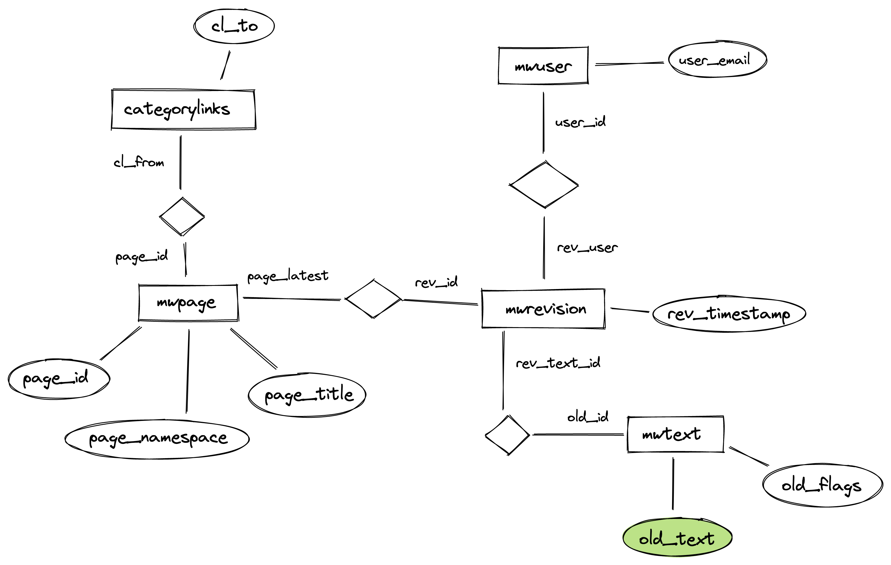

# wiki-migration

Migrate the old [Space Team](https://spaceteam.at/?lang=en) wiki from
[MediaWiki](https://www.mediawiki.org/wiki/MediaWiki) to
[BookStack](https://www.bookstackapp.com/).

**1) Get a DB dump and images folder**

[Paul](https://github.com/paulpaul168)
gave me mysql dump of the old wiki and a folder of images (with many
subfolders).

**2) Install mysql**

I installed docker and started with the mysql docker image.

```
docker run --name=mysql1 -p 3306:3306 -e MYSQL_ROOT_PASSWORD=123456 -d mysql:latest
```

This of course is not secure but that is fine as we only need it locally to pull it with python.

**3) Import data into mysql**

```bash
$ mysql --host=127.0.0.1 --port=3306 -u root -p
mysql> CREATE DATABASE old;
Query OK, 1 row affected (0.00 sec)
mysql> ^DBye

$ mysql --host=127.0.0.1 --port=3306 -u root -p old < dump.sql
```

**Note:** The import may take a couple of seconds

**4) Exploring the data**

There is an amazing
[online documentation](https://www.mediawiki.org/wiki/Category:MediaWiki_database_tables)
about the tables in mediawiki. Some
information was kinda outdated as the old wiki ran on a old mediawiki version
but after a bit of exploration I was able to put it visually together:



At this point I still needed to figure out in which subfolder I have to search
to find an image. After a bit of searching I found [documentation how images are stored](https://www.mediawiki.org/wiki/Manual:$wgHashedUploadDirectory).

**5) Run the Python script**

Last, I spent a couple of evenings crafting the `main.py` script. Which will
poll all pages from MySQL, replace all relative links with absolute ones to
the new wiki (so that linking between pages works), inline images, shell out to
pandoc to convert mediawiki to html and finally uploads them to BookStack.

First copy `config-example.toml` to `config.toml` and edit the file (the
comments will guide you).

Create a virtual environment with `python3 -m venv venv` and activate it with
`source venv/bin/activate`.

Now install all requirements with `pip install -r requirements.txt`.

Finally run the script `python main.py`.
